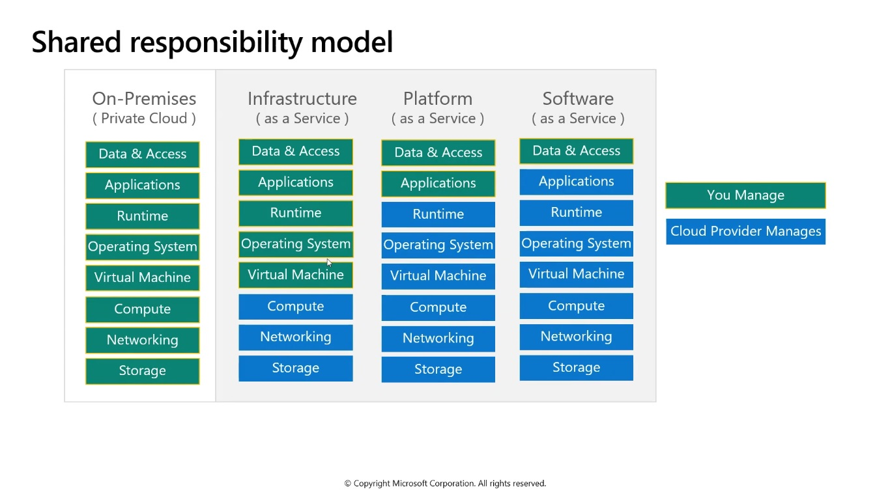
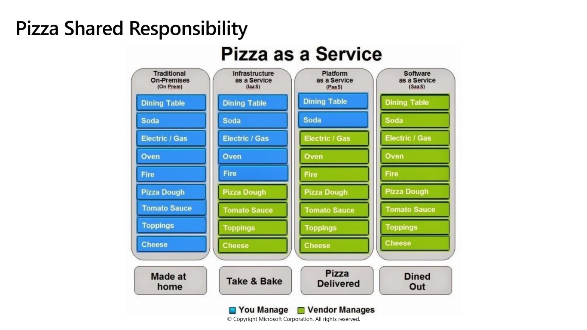
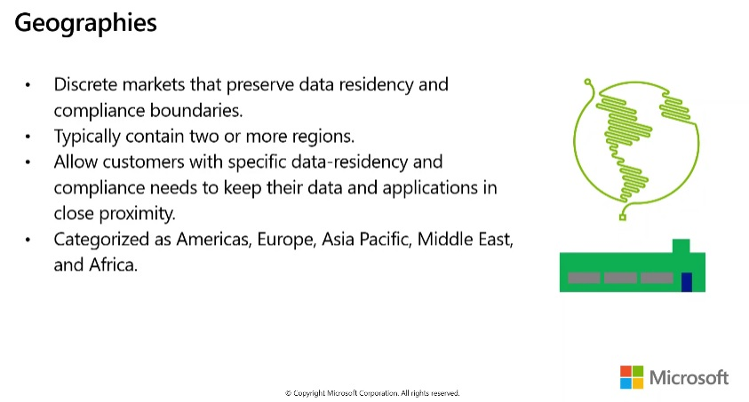

## Objective 1 - Cloud concepts

### Cloud Models - Objective Domain

- `Cloud computing`
  Is the delivering of computing services over the internet, enabling faster innovation, flexible resources and economies of scale.

- `Public cloud`
- - Owned by cloud services os hosting provider
- - Provides resources and services to multiple organizations and users
- - Accessed via secure network connection (typically over the internet)

- `Private cloud`
- - Organizations create a cloud environment in their datacenter
- - Organization is responsible for operating the services they provide
- - Does noite provide access to users outside of the oraganization

- `Hybrid cloud`
- - Combines **Public** and **Private** clouds to allow applications to run in the most appropriate location.

| Cloud model   | Comparison                                                                                                                                                                                                   |
| ------------- | ------------------------------------------------------------------------------------------------------------------------------------------------------------------------------------------------------------ |
| Public cloud  | - No capital expenditures to scale up   - Applications can be quickly provisioned and deprovisioned   - Organizations pay only for what they use                                                     |
| Private cloud | - Hardware must be purchased for start-up and maintenance   - Organizations have complete control over resources and security   - Organizations are responsible for hardware maintenance and updates |
| Hybrid cloud  | - Provides the most flexibility   - Organizations determine where to run their applications   - Organizations control security, compliance, or legal requirements                                    |

### Cloud Benefits - Objective Domain

- High availability
- Scalability
- Global reach
- Agility
- Disaster recovery
- Fault tolerance
- Elasticity
- Customer latency capabilities
- Predictive cost considerations
- Security

### Compare CapEx vs. OpEx

| Capital Expenditure (CapEx)                                                                                          | Operational Expenditure (OpEx)                                                       |
| -------------------------------------------------------------------------------------------------------------------- | ------------------------------------------------------------------------------------ |
| The up-front spending of money on physical infrastructure   Costs from CapEx have a value that reduces over time | Spend on products and services as needed, pay-as-you-go   Get billed immediately |

### Consumption-based model

Cloud service providers operate on a consumption-based model, which means that end users only pay for the resources that they use. Whatever they use is what they pay for

- Better cost prediction
- Prices for individual resources and services are provided
- Billing is based on actual usage

### Cloud Services - Objective Domain

- `Infrastructure-as-a-Service _(IaaS)_`

Build pay-as-you-go IT infrastructure by renting servers, virtual machines, storage, networks, and operating systems from a vloud provider.

- `Plataform-as-a-Service _(PaaS)_`
  Provides environment for building, testing, and deploying software applications, without focusing on managing underlying infrastructure

- `Software-as-a-Service _(SaaS)_`
  User connect to and use cloud-based apps over thw internet: for example, Microsoft Office 365, email, and calendars.

- `Hybrid cloud`
- - Combines **Public** and **Private** clouds to allow applications to run in the most appropriate location.

| Iaas                                                                                             | Paas                                                                                        | Saas                                                                                          |
| ------------------------------------------------------------------------------------------------ | ------------------------------------------------------------------------------------------- | --------------------------------------------------------------------------------------------- |
| The most flexible cloud service   You configure and manage the hardware for your application | Focus on application development   Platafor management is handled by the cloud provider | Pay-as-you-go pricing model   Users pay for the software they use on a subscription model |

### Serveless computing

With **serveless computing applications**, the cloud service provider automatically provisions, scales, and manages the infrastructure required to run the code.

- **Azure functions** is code running your service and not the underlying plataform or infrastructure. It creates infrastructure based on a event.
- **Azure Logic Apps** is a cloud service that helps you automate and orchestrate tasks, business processes, and workflows when you need to integrate apps, data, systems and services.

### Objective 1 - Review

- Microsoft offers Public, Private and Hybrid cloud models so you can build based on your needs.
- From high-availability to elasticity to disaster recovery to pay-as-use, the benefits of the Azure cloud are numerous.
- IaaS, Paas, SaaS and serveless, or a combination.
- Shared responsibility.

### Kwnowledge check

---

**Which cloud service type requires the customer to manage the underlying hypervisor plataform for their cloud deployments?**

- Infrastructure-as-a-Service
- Plataform-as-a-Service
- Software-as-a-Service
- `None of the above`

> **Note**: The hypervisor is part of the host system. Whe we see something like this, we're talking about the actual host.

---

**Which `cloud service type` would best match the following situation?**

Several web applications have been developed internally in your organization. The web applications allow users to enter details in a forma and those details are then emailed to a shared mailbox. The form is acessible from the internet and can be accessed anonymoulsy.

`Plataform-as-a-Service (PaaS)`

because the web applications are publicly accessible and do note require authentication, a PaaS service that allows customers to host web sites without having to manage servers would be best.

The websites can be deployed quickly and will have publicly accessible endpoints with minimal configuration.

## Emails could be sent using a `SaaS` solution as well.

**Which `cloud deployment model` would best match the following situation?**

A server is needed to process data for a short-term project. The organization does not have hardware that meets the perfomance requirements or any available staff to deploy it. The project starts in a few days and the server is not needed when the project is completed.

`Public cloud`

Because the server is only needed for a short time, public cloud would be the best option.

Creating a server in the public cloud will be cost-effective with pay per-usage billing and the resource can be removed when the project is complete.

A `PaaS` database could also be a candidate, eliminating the need for a server.

---

**The capability of a system to be enlarged to accommodate a growing amount of work is best described by the term?**

- Reliability
- Elasticity
- `Scalability`
- Agility

---

**In general terms, when an organization moves to the cloud will it see a reduction in CapEx, OpEx, or both?**

`Both`. Quite often, and immediate reduction in CapEx is realizaed by moving to the cloud. This can be through the immediate reduction in on-premises components by eliminating or migrating workloads.

Organizations can also see a reduction in the OpEx through the reduced time and hours spent on IT maintenance. Organizations that move to the cloud see a significant reduction in IT management tasks as responsibilities shift to the cloud provider.

---

## Objective 2 - Core Azure Services

### Core Azure architectural components - Objective Domain

#### **Regions**

Azure offers more global regions tha any other cloud provider with 60+ regions representing over 140 countries

- Regions are madeup of one or more datacenters in close proximity.
- Provide flexibility and scale to reduce customer latency.
- Preserve data residency with a comprehensive compliance offering.

##### **Regions pairs**

- At least 300 miles of separation between region pairs.
- Automatic replication for some services.
- Prioritized region recovery in the event of outage.
- Updates are rollout sequentially to minimize downtime.

#### **Availability zones**

- Provide protection against downtime due to datacenter failure.
- Physically separate datacenters within the same region.
- Each datacenter is equipped with independent power, cooling and networking.
- Connected through private fiber-optic networks.

### Azure Resources

Azure resources are components like storage, virtual machines and networks that are available to build cloud solutions.

- Virtual Machines
- Storage Accounts
- Virtual Networks
- App Services
- SQL Databases
- Function

#### Resource groups

A resource group is a container to manage ad aggregate resources in a single unit.

- Resources can exist in only one resource group
- Resources can exist in different regions
- Resources can be moved to different resource groups
- Applications can utilize multiple resource groups

#### Azure Resource Manager (ARM)

Provides a management layer that enables you to create, update and delete resources in your Azure subscription.

#### Azure Subscriptions

An Azure subscription provides you with authenticated and authorized access to Azure accounts.

- **Biling boundary**: generate separate billing reports and invoices for each subscription.
- **Access control boundary**: manage and control access to the resources that users can provision with specific subscriptions.

#### Management Groups

Management Groups can include multiple Azure subscriptions.

- Subscription inherit conditions applied to the management group
- 10000 management groups can be supported in a single directory
- A management group can support up to six levels of depth.

### Azure Compute Services

Azure compute is an on-demand computing service that provides computing resources such as disks, processors, memory, networking and operating systems.

#### Azure Virtual Machines

Azure Virtual Machines (VM) are software emulations of physical computers.

- Includes virtual processor, memory, storage and networking
- Iaas offering that provides total control customization

#### Azure App Services

Azure App Services is a fully managed platform to build deploy and scale web apps and API quickly.

- Works with .NET, .NET Core, Node.js, Java, Python or php
- PaaS offering with enterprise-grade performance, security and compliance requirements

#### Azure Container Services

Azure Containers are a light-weight, virtualized environment that does not require operating system management and can respond to changes on demand.

- **Azure Container Instances**: a Paas offering that runs a container in Azure without the need to manage a virutal machine or aditional services,
- **Azure Kubernetes Service**: an orchestration service for containers with distributed architectures and large volumes of containers.

#### Windows Virtual Desktop

Windows Virtual Desktop is a desktop and app virtualization that runs in the cloud.

#### Azure Networking Services

- **Azure Virtual Network (VNet)** enables Azure resources to communicate with each other, the internet, and on-premises networks
- **Virtual Private Network Gateway (VPN)** is used to send encrypted traffic between an Azure virtual network and on-premises location over the public internet
- **Azure Express Route** extends on-premises networks into Azure over a private connection that is facilitated by a connectivity provider

#### Azure Storage Services

- **Container storage (blob)** is optimized for storing massive amounts of unstructured data, such as text or binary data.
- **Disk storage** provides disk for virtual machines, applications, and other services to access and use.
- **Azure Files** sets up a highly available network file shares that can be accessed by using the standart Server Message Block (SMB) protocol

**Azure storage access tiers**

- `Hot`: optimized for storing data tha is acessed frequently
- `Cool`: optimized for storing data tha is infrequently accessed and stored for at least 30 days
- `Archive`: optimized for storing data tha is rarely acessed and stored for at least 180 dyas with flexible latency requirements

You can switch between these access tiers at any time.

#### Azure Database Services

- **Azure Cosmos Database** is a globally-distributed database service that elastically and independetly sacles throughput and storage.
- **Azure SQL Database** is a relational database as a service (Daas) based on the latest stable version of the Microsoft SQL Server.
- **Azure Database for MySQL** is a fully-managed MySQL database service for app developers
- **Azure Database for PostgreSQL** is a relational database as a service based on the open-source Postgres database engine.

#### Azure SQL Managed Instance

Azure SQL Managed Instance allows existing SQL Server customers to lift and shift their on-premises applications to the cloud with minimal application and database changes

### Azure MarketPlace

Azure MarketPlace allows customers to find, try, purchase and provision application and services from hundreds of leading service providers, which are all certified to run on Azure.

### Objective 2 - Review

- Microsoft provides more global presence than any other cloud provider with over 60 regions distributed worldwide
- Azure Management tools
- Azure's multiple services (compute, networking, storage and databases)
- Azure Marketplace

### Kwnowledge check

---

**Pick the term that best describes the feature that is made up of one or more datacenters equipped with the indenpendent powe, cooling and networking. It is setup to be an isolation boudary. If one goes down, the others continue to workd. They are typically connected to each other through very fast, private fiber-optic networks.**

- Availability sets
- `Availability zones`
- Regional Availability

---

**Suppose you have an existing application running local on your own server. You need additional capacity to move to Azure instead of buying upgraded on-premises hardware. Which compute option would likely give you the quickest route to getting your application running on Azure?**

`Virtual machines`. You have full control over thw VM setup, so you can configure it to match your on-premises server. This will allow your existing application to run on the Azure VM with litle or no change.

---

**Which service offers a distributed network of servers that can efficiently deliver web content to users that focuses on minimizing latency**

- Azure Virtual Network
- Azure Load Balancer
- Azure Application Gateway
- `Content Delivery Network`

A `Content Delivery Network` is a distributed network of servers that can efficiently deliver web content to users. It is a way to get content to users in their local region to minimize latency. CDN can be hosted in Azure or any other location.

---

## Objective 3 - Core Azure Solutions

### Azure Solutions - Objective Domain

#### **Azure Internet of Things**

**Internet of Things (IoT)** is the ability for services to garner and then relay information for data analysis.

- **Azure IoT Central** is a fully managed global IoT SaaS solution that makes it easy to connect, monitor and manage IoT assets at a scale.
- **Azure IoT Hub** is a managed service hosted in the cloud that acts as a central message hub for bi-directional communication between IoT applications and the devices ir manages.
- **Azure Sphere** is a secured, high-level application platform with built-in communication and security features for internet-connected devices.

#### **Big data and analytics**

- **Azure Synapse Analytics**: a cloud-based enterprise data warehouse.
- **Azure HDInsight**: a fully-managed, open-source analytics service for enterprises.
- **Azure Databricks**: Apache Spark based analytics service.

#### **Artificial Intelligence & Machine Learning**

- **Azure Machine Learning**: cloud-based to develop, train and deploy machine learning models.
- **Cognitive Services**: quickly enable apps to see, hear, speak, understand and interpret a user's need.
- **Azure Bot Services**: develop intelligent, enterprise-grade bots.

#### **Serveless Computing**

- **Azure Functions**: event based code running your service and not the underlying infrastructure.
- **Azure Logic Apps**: automate and orchestrate tasks, business processes, and workflows to integrate apps.

#### **Develop your apps with DevOps and GitHub**

- **Azure DevOps**: development collaboration tools including pipelines, Kanban boards and automated cloud-based load testing.
- **GitHub**: softare development hosting with version control, source code management and bug/task management.
- **GitHub Actions for Azure**: automate software workflow to build, test, and deploy from within GitHub.
- **Azure DevTest Labs**: quicly creates environments in Azure while minimizing waste and controlling cost.

### Azure Management Tools - Objective Domain

#### **Azure Advisor**

**Azure Advisor** analyzes deployed Azure resources and makes recommendations based on best practices to optmize Azure deployments.

- Reliability
- Security
- Performance
- Cost
- Operational Excellence

#### **Azure Monitor**

**Azure Monitor** maximizes the availability and perfomance of applications and services by collecting, analyzing and acting on telemetry from cloud and on-premises enviroments

- Application Insights
- Log Analytics
- Smart Alerts
- Automation Actions
- Customized Dashboards

#### **Azure Service Help**

Evaluates the impact of Azure service issues with personalized guidance and support, notifications, and issue resolution updates.

**Azure Service Help** provides a personalized view of the health of Azure services and regions being used.

- Communication regarding outages
- Planned maintenance
- Other health advisories

#### **Azure Resource Manager (ARM) templates**

**Azure Resource Manager (ARM) templates** are JavaScript Object Notation (JSON) files that can be used to create and deploy Azure infrastructure without having to write programming commands.

- Declarative syntax
- Repeated results
- Orchestration
- Modular files
- Built-in validation
- Exportable code

### Objective 3 - Review

- Azure Services: IoT, big data, analytics and development tools.
- Azure Resource Manager
- Azure Monitoring Tools

### Kwnowledge check

---

**Your company has multiple web properties that a customer can reach you. You would like to create a common set of code that each of the can use to create a lead in your customer database. Which service Azure App Service app would you use?**

- Azure Web App
- Azure Mobile App
- `Azure Api App`
- Web Apps for Containers

`Azure Api Apps` are designed to expose functionality as an application programming interface or API. APIs allow multiple clients to use the same code base using common protocols such as HTTP and HTTPs.

---

**Which service below is NOT considered a feature of Azure serveless computing?**

- `Azure Machine Learning`
- Azure Functions
- Azure Logic Apps
- Azure Event Grid

`Azure Machine Learning` provides a cloud-based environment you can use to develop, train, test, deploy, manade and track machine learning models. Azure Machine Learning service can auto-generate a model an auto-tune it for you. It will let you start training on your local machine and then scale out to the cloud. When you have the right model, you can easily deploy it in a container such as Docker in Azure.

---
